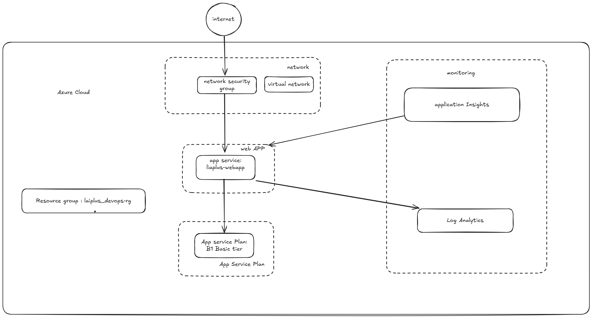

# Azure App Service Deployment Guide
## Flow chart

## Azure Configuration

### Resource Group Setup
```bash
# Login to Azure
az login

# Create a resource group
az group create --name liaplus-devops-rg --location eastus
```

### App Service Plan and Web App Creation
```bash
# Create an App Service Plan (B1 Basic tier)
az appservice plan create --name liaplus-asp --resource-group liaplus-devops-rg --sku B1 --is-linux

# Create a Web App with Python runtime
az webapp create --name liaplus-webapp --resource-group liaplus-devops-rg --plan liaplus-asp --runtime "PYTHON|3.9"

# Configure the Web App
az webapp config set --name liaplus-webapp --resource-group liaplus-devops-rg --startup-file "gunicorn --bind=0.0.0.0 --timeout 600 app:app"
```

### Set up Application Insights
```bash
# Create Application Insights
az monitor app-insights component create --app liaplus-app-insights --location eastus --resource-group liaplus-devops-rg --application-type web

# Get the instrumentation key
INSTRUMENTATION_KEY=$(az monitor app-insights component show --app liaplus-app-insights --resource-group liaplus-devops-rg --query instrumentationKey -o tsv)

# Configure Web App with App Insights
az webapp config appsettings set --name liaplus-webapp --resource-group liaplus-devops-rg --settings APPINSIGHTS_INSTRUMENTATIONKEY=$INSTRUMENTATION_KEY
```

## Application Deployment

### Method 1: Direct Deployment from Local Machine
```bash
# Set up the local Git deployment
az webapp deployment source config-local-git --name liaplus-webapp --resource-group liaplus-devops-rg

# Get the deployment URL
DEPLOYMENT_URL=$(az webapp deployment list-publishing-profiles --name liaplus-webapp --resource-group liaplus-devops-rg --query "[?publishMethod=='MSDeploy'].publishUrl" -o tsv)

# Add the remote to your Git repo
git remote add azure $DEPLOYMENT_URL

# Push your code
git push azure master
```

### Method 2: Using ZIP Deployment
```bash
# Create a ZIP file of your application
zip -r app.zip app.py requirements.txt templates/

# Deploy the ZIP file
az webapp deployment source config-zip --resource-group liaplus-devops-rg --name liaplus-webapp --src app.zip
```

### Method 3: Using GitHub Actions (Preferred)
1. Set up a GitHub repository with your code
2. Create GitHub Actions workflow (see CI/CD section)
3. Configure deployment credentials:
```bash
# Get the publish profile
az webapp deployment list-publishing-credentials --name liaplus-webapp --resource-group liaplus-devops-rg --xml > publish_profile.xml

# Add this as a secret in your GitHub repository named AZURE_WEBAPP_PUBLISH_PROFILE
```

## Verifying Deployment
After deployment, the application should be accessible at:
`https://liaplus-webapp.azurewebsites.net`

You can verify the health endpoint at:
`https://liaplus-webapp.azurewebsites.net/health`

## Networking Configuration
By default, App Service provides a public endpoint. For enhanced security:

```bash
# Create a Virtual Network
az network vnet create --resource-group liaplus-devops-rg --name liaplus-vnet --address-prefix 10.0.0.0/16 --subnet-name default --subnet-prefix 10.0.0.0/24

# Configure App Service VNet Integration
az webapp vnet-integration add --resource-group liaplus-devops-rg --name liaplus-webapp --vnet liaplus-vnet --subnet default
```
